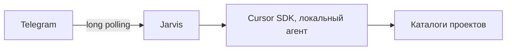

# Jarvis

[English](README.en.md)

Telegram-демон для локальных агентов Cursor SDK. Задача ставится из чата, агент читает и пишет файлы на машине, где запущен Jarvis. Редактор нужен только чтобы посмотреть результат.

Репозиторий приватный. Версия `0.1.0`.

## Возможности

- Долгий опрос Telegram: демон работает, пока жив процесс и есть сеть. Публичный адрес и входящие порты не нужны.
- Доступ только для указанных числовых идентификаторов Telegram.
- Несколько проектов на диске. В чате активен один, переключение не прерывает чужой прогон.
- Локальный агент Cursor SDK: модель и каталог проекта задаются явно, диалог продолжается через `send` и `resume`.
- Выбор модели и уровня рассуждения из каталога аккаунта.
- Живой ответ в чате: правки не чаще раза в секунду, новая фраза с заглавной буквы начинается со следующей строки.
- Список файлов проекта и отправка файла. Каталог или весь проект уходит архивом, если размер укладывается в лимит Telegram.

## Как это устроено



Модель считается в облаке Cursor. На диске демона остаются файлы проектов, сессии SQLite и состояние локального агента.

| Каталог | Назначение |
| --- | --- |
| Корень этого репозитория | Код Jarvis |
| `projects_root` из `config.yaml` | Рабочие проекты агента. Это не каталог самого Jarvis |

## Требования

- Python 3.10 или новее
- Windows x64, на котором демон проверялся, либо другая система с официальным wheel `cursor-sdk` (Linux x64/arm64, macOS)
- Отдельный бот Telegram. Токен моста Cursor MCP для этого демона не подходит: два long poll на один токен конфликтуют
- Ключ Cursor API того же аккаунта, с которого должны списываться запросы
- Постоянно включённая машина: экран может быть заблокирован, процесс демона — нет

Видеокарта не нужна. Нагрузка на процессор и память появляется, когда агент собирает проект, ставит пакеты или запускает тесты.

## Установка

```powershell
git clone <url-этого-репозитория>
cd Jarvis-cursor-sdk-telegram
python -m venv .venv
.\.venv\Scripts\pip install -e .
copy .env.example .env
copy config.example.yaml config.yaml
```

Заполните `.env` и пути в `config.yaml`. Затем:

```powershell
.\.venv\Scripts\python.exe -m jarvis
```

На Windows тот же запуск делает `start.bat` из корня репозитория, после того как виртуальное окружение уже создано.

В Telegram отправьте боту `/start`. Если список разрешённых пользователей пуст, бот ответит вашим числовым id. Добавьте его в `TELEGRAM_ALLOWED_USER_IDS` и перезапустите демон. Дальше: `/new` или `/open`, затем `/task`.

## Конфигурация

Секреты только в `.env`. Этот файл не коммитится.

| Переменная | Смысл |
| --- | --- |
| `TELEGRAM_BOT_TOKEN` | Токен бота от BotFather |
| `TELEGRAM_ALLOWED_USER_IDS` | Числовые id через запятую. Пустое значение включает режим настройки на `/start` |
| `CURSOR_API_KEY` | Пользовательский ключ или ключ service account |

`config.yaml` задаёт пути и модель по умолчанию. Образец: `config.example.yaml`. Файл `config.yaml` тоже не коммитится: в нём путь этой машины.

`projects_root` и `bridge_workspace` лучше не менять между перезапусками. Локальные агенты привязаны к workspace моста SDK. Если путь сменится, `resume` может не найти прежний диалог.

## Команды

Кнопки клавиатуры вызывают те же действия, что и команды.

| Команда | Действие |
| --- | --- |
| `/start` | Клавиатура и текущий проект |
| `/help` | Справка |
| `/status` | Конфиг без секретов |
| `/new [имя]` | Новый каталог в `projects_root` |
| `/open` | Подключить уже существующий каталог |
| `/projects` | Список и переключение активного проекта |
| `/task [текст]` | Задача активному агенту |
| `/files [путь]` | Дерево файлов |
| `/get путь` | Прислать файл. Каталог или `.` — архив |
| `/model` | Модель, затем уровень рассуждения |
| `/effort` | Только уровень рассуждения текущей модели |
| `/stop` | Отменить ввод или текущий прогон |

Обычное сообщение при выбранном проекте уходит в тот же агент как продолжение диалога.

Имена проектов: латиница, цифры, точка, дефис. Скрытые каталоги вроде `.git`, `venv` и `node_modules` в список файлов и в архив не попадают. Документ больше примерно 50 МБ Telegram не примет.

## Ограничения версии 0.1.0

- Интерфейс чата на русском. Отдельного Mini App нет.
- Агенты только локальные. Облачный runtime Cursor в этот демон не подключён.
- Один процесс `python -m jarvis` на один токен бота.
- Параллельные проекты заложены в коде, но как устойчивый режим ещё не подтверждены.
- Автозапуск службой Windows в эту версию не входит. Демон запускается вручную или через `start.bat`.

## Документы

- [Участие в разработке](CONTRIBUTING.md)
- [Безопасность](SECURITY.md)
- [История изменений](CHANGELOG.md)
- [Лицензия MIT](LICENSE)

Дальнейшие версии фиксируются в истории изменений и в релизах GitHub. Текст релизов ведётся на русском.
